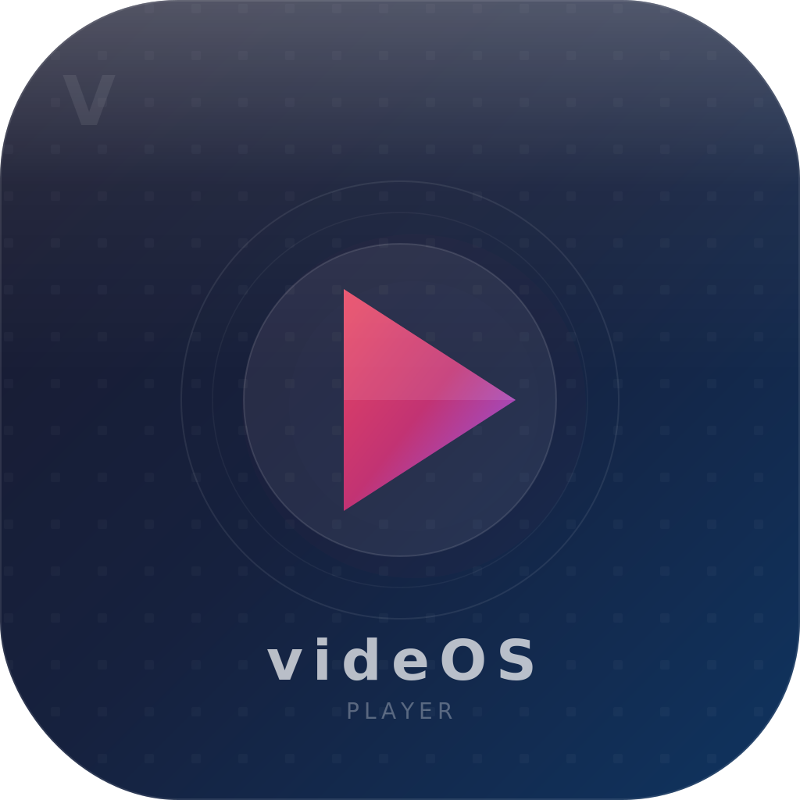

<p align="center">
  
</p>

<h1 align="center">videOS</h1>

<p align="center">
  <strong>Ultra-Advanced Native macOS Video Player</strong><br>
  <em>Powered by libVLC. Built with Swift + SwiftUI. No Xcode.</em>
</p>

<p align="center">
  <a href="https://github.com/Worth-Doing/videOS/releases/latest"></a>
</p>

<p align="center">
  
  
  
  
  
</p>

<p align="center">
  
  
  
  
  
</p>

---

## Metrics

<p align="center">
  
  
  
  
</p>

<p align="center">
  
  
  
  
  
  
</p>

<p align="center">
  
  
  
  
  
  
</p>

<p align="center">
  
  
  
  
</p>

---

## Overview

**videOS** is a premium macOS video player that bridges directly to libVLC's C API for maximum format support and performance. No VLCKit, no Objective-C wrappers — pure Swift-to-C interop with `Unmanaged` pointer callbacks dispatched to `@MainActor`.

The UI is built entirely in SwiftUI with a glass morphism design language: translucent materials, blur effects, gradient accents, and spring-based animations. The app is developed, built, and packaged entirely from the CLI — no Xcode project files.

---

## Features

### Playback Engine
- Play any video/audio format supported by libVLC (300+ codecs)
- Network stream playback (HTTP, HTTPS, RTSP, HLS, RTP, UDP, MMS)
- Variable speed playback (0.25x – 4.0x)
- Audio/subtitle track selection with delay adjustment
- External subtitle loading (.srt, .ass, .ssa, .vtt) with auto-detection of sidecar files
- Resume playback from last position (auto-saved every 5s)
- Playlist auto-advance with next/previous navigation
- Hardware-accelerated decoding via VideoToolbox

### Library & Organization
- Scan folders for media files with recursive discovery
- Search, sort (name, date, last played, duration), and filter
- List and grid view modes with hover effects
- Play count tracking and recently played history
- Drag-and-drop file/folder import
- "Show in Finder" and "Copy Path" context actions

### Playlists
- Create, rename (inline), and delete playlists
- Add/remove/reorder items with drag and drop
- "Play All" for instant playlist playback
- Persistent storage across sessions

### Bookmarks
- Named bookmarks at any timestamp in a video
- Jump to bookmark with one click
- Filtered by currently playing media

### Network Streams
- URL validation with protocol detection
- Protocol hint chips (HTTP, RTSP, HLS, RTP)
- Recent streams history with relative timestamps
- Copy URL and quick-play actions

### UI/UX
- Glass morphism design (`.ultraThinMaterial`, blur, gradients)
- Auto-hiding controls with configurable delay
- Seek bar with hover preview, buffered range, and glow thumb
- Volume slider with 4-level icons, expand-on-hover
- Branded empty state with action pills and keyboard shortcut hints
- Error banner with dismiss action
- Media info overlay (title, codec, resolution, duration, file size)
- Native macOS sidebar with sections, badges, and recently played
- Full Settings window (General, Playback, Library, Shortcuts tabs)

### Keyboard Shortcuts

| Key | Action |
|-----|--------|
| `Space` | Play / Pause |
| `→` / `←` | Seek ±10s |
| `Shift+→` / `Shift+←` | Seek ±30s |
| `Option+→` / `Option+←` | Seek ±5s |
| `↑` / `↓` | Volume ±5% |
| `M` | Toggle mute |
| `Cmd+F` | Toggle fullscreen |
| `[` / `]` | Speed down / up |
| `=` | Reset speed |
| `Cmd+N` / `Cmd+P` | Next / Previous track |
| `Cmd+O` | Open file |
| `Cmd+Shift+S` | Toggle sidebar |
| `Cmd+,` | Settings |

---

## Architecture

```
┌─────────────────────────────────────────────────────────┐
│                    SwiftUI Views (15)                     │
│  Sidebar │ PlayerView │ ControlBar │ Library │ Playlists │
├─────────────────────────────────────────────────────────┤
│              ViewModels (3) — @MainActor                 │
│     PlayerVM │ LibraryVM │ PlaylistVM                    │
├─────────────────────────────────────────────────────────┤
│               Services (8) — ObservableObject            │
│  PlayerEngine │ Library │ Playlists │ Bookmarks │ ...    │
├─────────────────────────────────────────────────────────┤
│        CLibVLC Module — C bridging (80+ functions)       │
│              shim.h │ module.modulemap │ -lvlc           │
├─────────────────────────────────────────────────────────┤
│            libvlc.dylib (bundled from VLC.app)           │
└─────────────────────────────────────────────────────────┘
```

### libVLC Bridging

videOS bridges to libVLC's raw C API through a custom SPM system library target:

- `CLibVLC/include/shim.h` — declares 80+ VLC functions, opaque types, and event enums
- `CLibVLC/module.modulemap` — makes the C headers importable as a Swift module
- `PlayerEngine.swift` — wraps the C API with `Unmanaged<Self>` pointer casting for event callbacks
- VLC events fire on background threads → dispatched to `@MainActor` via `DispatchQueue.main`
- NSView passed to VLC via `libvlc_media_player_set_nsobject()` for zero-copy rendering

---

## Project Structure

```
videOS/
├── Package.swift                  # SPM: macOS 13+, CLibVLC + app target
├── Makefile                       # build, run, package, test, clean
├── CLAUDE.md                      # Architecture guide & roadmap
├── scripts/
│   ├── install-deps.sh            # VLC dependency check/install
│   ├── build.sh                   # Debug/release builds
│   ├── run.sh                     # Launch with dylib paths
│   ├── package.sh                 # .app bundle creation
│   └── create-dmg.sh             # DMG + codesign + notarize + staple
├── Sources/
│   ├── CLibVLC/                   # C bridging layer
│   │   ├── include/shim.h         # libVLC type/function declarations
│   │   └── module.modulemap       # Swift module mapping
│   └── videOS/
│       ├── App.swift              # @main + AppState (owns all services)
│       ├── AppDelegate.swift      # NSApplicationDelegate
│       ├── Models/                # 7 Codable data models
│       ├── Services/              # 8 business logic services
│       ├── ViewModels/            # 3 @MainActor view models
│       ├── Views/                 # 10 SwiftUI views
│       ├── Views/Components/      # 5 reusable UI components
│       └── Utilities/             # Constants, formatters, helpers
├── Tests/                         # 14 unit tests
└── Resources/
    ├── Info.plist                  # App bundle config
    ├── videOS.entitlements         # Security entitlements
    ├── logo.svg                   # App icon (SVG source)
    └── icon.icns                  # App icon (macOS ICNS)
```

---

## Build & Run

### Prerequisites

```bash
# Install VLC (provides libvlc.dylib + plugins)
brew install --cask vlc
```

### Commands

```bash
make deps          # Verify VLC is installed
make build         # Debug build
make release       # Optimized release build
make run           # Build and launch
make test          # Run unit tests
make package       # Create videOS.app bundle
make clean         # Clean build artifacts
```

### Create Signed & Notarized DMG

```bash
bash scripts/create-dmg.sh
```

This script:
1. Builds release binary
2. Creates `.app` bundle with bundled libVLC + 337 plugins
3. Fixes rpaths for self-contained distribution
4. Codesigns everything with Developer ID (hardened runtime)
5. Creates compressed DMG
6. Submits to Apple notary service
7. Staples notarization ticket

---

## Persistence

All data is stored in `~/Library/Application Support/videOS/`:

| File | Content |
|------|---------|
| `library.json` | Scanned media items |
| `playlists.json` | User playlists |
| `bookmarks.json` | Named bookmarks |
| `playback-state.json` | Resume positions |
| `streams.json` | Recent stream URLs |

---

## V2 Roadmap

### AI Subtitle Tools
- Auto-generate subtitles via Whisper
- Real-time subtitle translation
- Subtitle search (find when a word was said)
- Smart timing synchronization

### Clip Export
- Trim and export video clips
- GIF export with subtitle burn-in
- Batch export bookmarked segments

### Metadata Enrichment
- Auto-fetch movie/TV metadata from TMDb
- Poster art and backdrop integration
- Smart file rename from metadata

### Advanced Playback
- A-B loop
- Picture-in-Picture
- Audio normalization
- Watch party (LAN synchronized playback)

---

## Tech Stack

| Layer | Technology |
|-------|-----------|
| Language | Swift 5.9 |
| UI | SwiftUI (macOS 13+) |
| Playback | libVLC 3.x (C API) |
| Reactivity | Combine |
| Concurrency | @MainActor + Task |
| Persistence | Codable + JSON |
| Preferences | UserDefaults / @AppStorage |
| Build | Swift Package Manager + Make |
| Packaging | Shell scripts + hdiutil |
| Signing | codesign + Developer ID |
| Notarization | xcrun notarytool |
| Dependencies | Zero external Swift packages |

---

<p align="center">
  Built with Swift + SwiftUI by <a href="https://github.com/Worth-Doing">WorthDoing AI</a><br>
  <sub>Signed & Notarized for macOS. Zero third-party dependencies.</sub>
</p>
